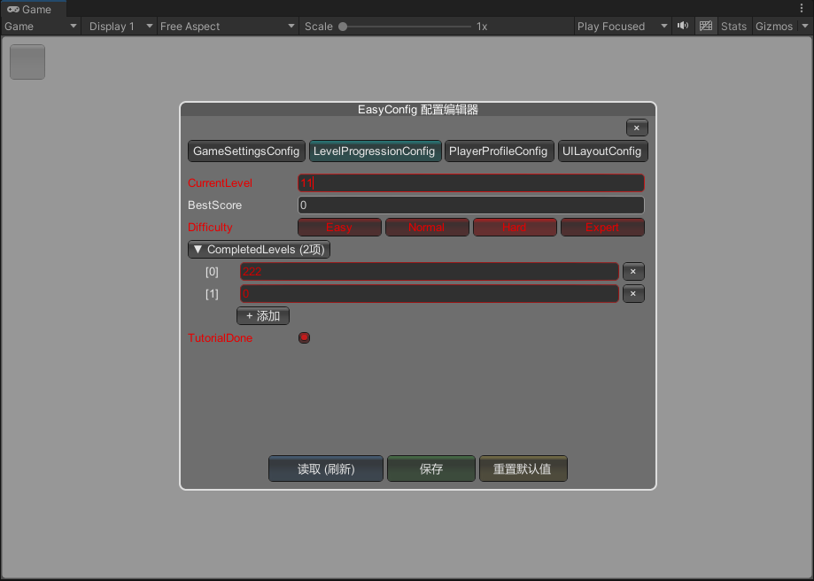
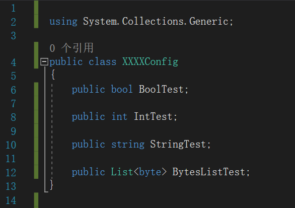
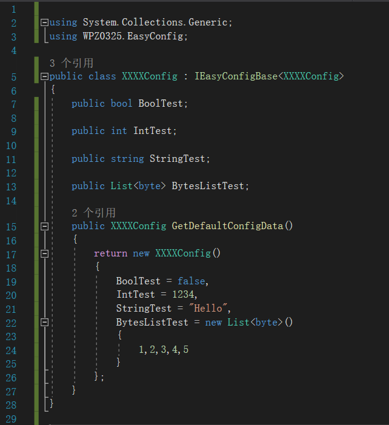
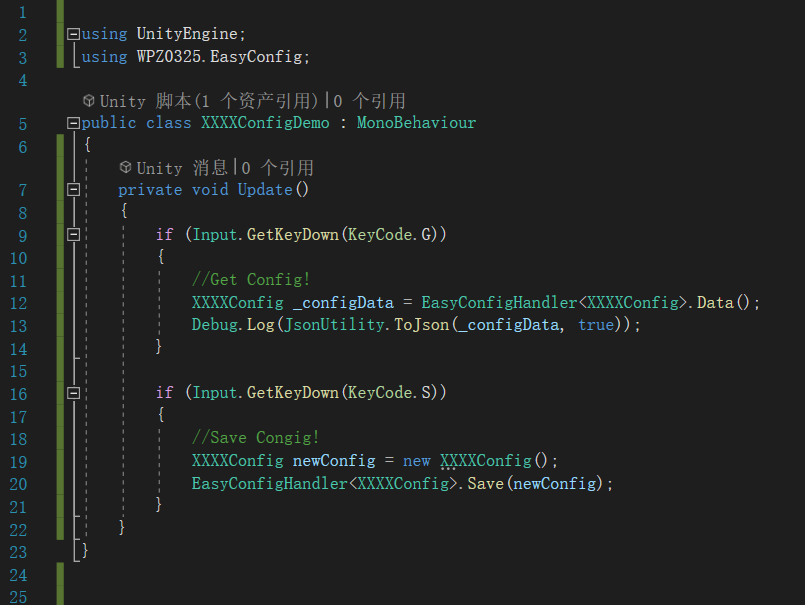
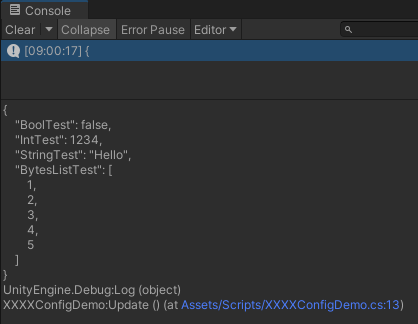

# Unity3D-Easy-Config

> 一种快速的、轻量的、简单的本地序列化配置功能  
> A fast, lightweight, and simple local serialization configuration feature

---

## 可视化配置 / Visual Configuration

> 插件内置运行时配置编辑器 `EasyConfigRuntimeEditor`，挂载到场景任意 GameObject 即可在 PC / 安卓 / AR 等平台通过浮动按钮呼出，直接编辑配置参数，修改前后差异以红色标记，无需手动操作 JSON 文件。
>
> The plugin includes a built-in runtime configuration editor `EasyConfigRuntimeEditor`. Simply attach it to any GameObject in the scene, and summon it via a floating button on PC / Android / AR platforms to directly edit configuration parameters. Unsaved changes are highlighted in red, eliminating the need to manually edit JSON files.

  

运行时配置编辑器 / Runtime Configuration Editor

---

## 核心用法 / Core Usage

- `EasyConfigHandler<YourConfigClass>.Data()`
- `EasyConfigHandler<YourConfigClass>.Save(newConfig)`

> 注意：内置缓存机制，故支持 Update() 等高频访问  
> Note: Built-in caching mechanism, therefore supports high-frequency access such as Update().

### 核心方法 / Core Methods

1. 泛型接口 / Generic Interface — `IEasyConfigBase<T>`
2. 泛型配置控制类 / Generic Controller — `EasyConfigHandler<T>`

---

## 使用步骤 / Usage Steps

### Step 1

导入插件 `WPZ0325.EasyConfig`，创建自定义配置类并根据需求自定义配置的数据结构

> Import the plugin `WPZ0325.EasyConfig`, create a custom configuration class and customize the data structure as needed.

  

自定义配置数据结构 / Customize data structure

### Step 2

引入命名空间 `WPZ0325.EasyConfig`，给配置类实现接口 `IEasyConfigBase<XXXXConfig>`，并设定配置的默认值

> Introduce the namespace `WPZ0325.EasyConfig`, implement the `IEasyConfigBase<XXXXConfig>` interface for the configuration class, and set the default values for the configuration.

  

实现接口并设定默认值 / Implement interface & set defaults

### Step 3

在业务代码中直接使用 `EasyConfigHandler<XXXXConfig>` 来获取配置数据或更新配置数据，如下图：

> In the business code, directly use `EasyConfigHandler<XXXXConfig>` to obtain or update configuration data, as shown in the figure below:

  

获取/更新配置数据 / Get & update config data

### Step 4

结束！  
> The end!

  

完成 / Done

---

## 补充说明 / Additional Notes

执行程序后 StreamingAssets 自动生成文件夹 `EasyConfigsRoot`

> After running the program, the `StreamingAssets` folder `EasyConfigsRoot` is automatically created.

该文件夹里面存放配置 Json 文件，用户可根据需要直接自定义编辑参数值即可

> This folder contains configuration JSON files. Users can directly customize and edit the parameter values as needed.
